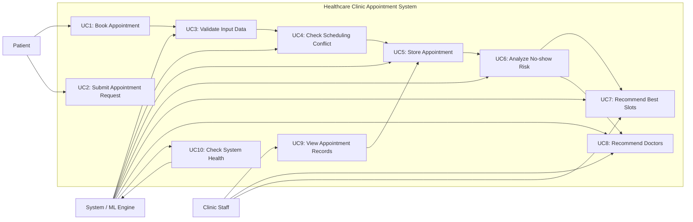

# UML Use Case Diagram

## Use Case Diagram

## Use Case Descriptions

### UC1: Book Appointment
A patient enters appointment details through the clinic website.

### UC2: Submit Appointment Request
The front-end sends the booking request to the server for processing.

### UC3: Validate Input Data
The system verifies that required fields are present and correctly formatted.

### UC4: Check Scheduling Conflict
The system compares the new request against existing appointment data to avoid duplicate bookings.

### UC5: Store Appointment
Valid appointments are saved locally in the appointments JSON file.

### UC6: Analyze No-show Risk
The ML-style engine evaluates appointment risk and generates a no-show probability and confidence score.

### UC7: Recommend Best Slots
The system ranks available appointment slots based on predicted risk and availability.

### UC8: Recommend Doctors
The system suggests suitable doctors based on the consultation type and expected schedule load.

### UC9: View Appointment Records
Clinic staff can inspect stored requests to manage bookings and schedule planning.

### UC10: Check System Health
A developer or monitoring system verifies that the service is live through the health endpoint.

## Notes
This diagram reflects the current demo implementation of the healthcare clinic project. It intentionally represents lightweight heuristic-based recommendations rather than a full production clinical workflow.
