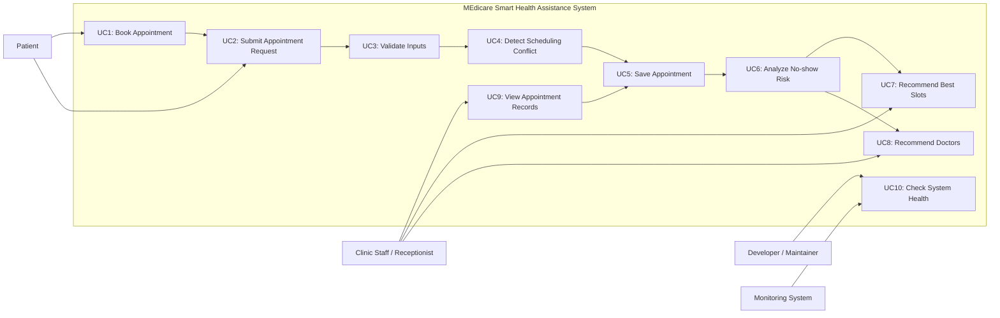
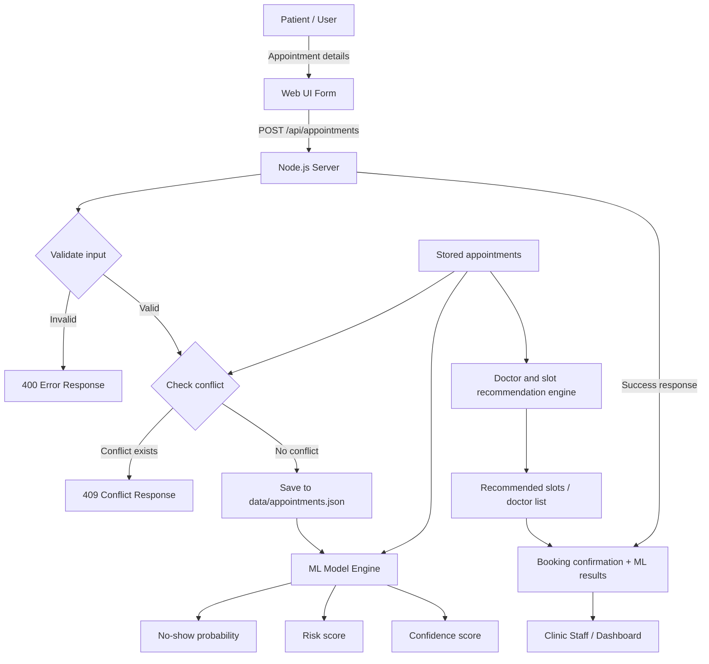

# UML and Data Flow Documentation

## 1. System Actors
The current project uses the following actors and roles:

- Patient: submits appointment requests and views booking confirmation.
- Clinic Staff / Receptionist: reviews appointment records and uses recommendation outputs.
- Developer / Maintainer: deploys and monitors the application.
- Monitoring System: checks the backend availability through the health endpoint.

## 2. Use Case Diagram

## 3. Use Case Descriptions

### UC1: Book Appointment
A patient opens the booking form and enters personal and appointment information.

### UC2: Submit Appointment Request
The front-end sends the appointment details to the backend API as JSON.

### UC3: Validate Inputs
The server checks required fields, date format, time format, and whether the date is in the past.

### UC4: Detect Scheduling Conflict
The system compares the new request with existing appointments and prevents duplicate doctor/date/time bookings.

### UC5: Save Appointment
If the request is valid and conflict-free, the appointment is stored in the local JSON file.

### UC6: Analyze No-show Risk
The ML-style engine evaluates the appointment and calculates no-show probability, confidence, and general risk.

### UC7: Recommend Best Slots
The system ranks available slots for the selected doctor and date based on predicted risk and current schedule load.

### UC8: Recommend Doctors
The system suggests the best doctor options based on the consultation type and date-specific availability.

### UC9: View Appointment Records
Clinic staff can inspect the stored appointment dataset through the public API or the application’s data output.

### UC10: Check System Health
A developer or external monitoring service verifies that the Node.js service is alive through the health endpoint.

## 4. Data Flow Diagram

## 5. Architectural Notes
- The front-end is served by the browser and communicates with the Node.js backend via REST endpoints.
- The backend uses `server.js` for routing, validation, persistence, and responses.
- The ML logic is implemented in `js/ml-models.js` and is currently heuristic rather than a production-grade clinical model.
- Data persistence is file-based using `data/appointments.json`.

## 6. Notes
This UML and flow documentation reflects the current implementation of the MEdicare Smart Health Assistance project. It intentionally models the existing lightweight, demo-grade clinic booking workflow, including basic ML-style analysis and recommendation support.
